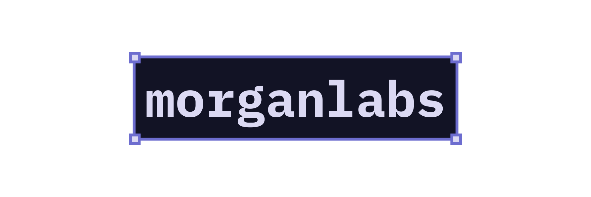

# Hello! I'm Morgan...

I am a full-stack website developer. I like to spend my time listening to
music, learning new things, creating websites and designs, and creating games!

I am currently persuing an **Information Technology Extended Diploma (Level 3)**
at **Coleg Llandrillo**, where I have gained experience in:

- Databases (Microsoft Access)
- Website development
- Games development
- Cybersecurity

I am studying in Information Technology in Coleg Llandrillo at Level 3, which
has seen me studying datases (Microsoft Access), website development, games
development, cybersecurity, and much more.

## I work with...

- **Languages**: TypeScript, JavaScript, HTML, SCSS
- **Frameworks & Libraries**: Astro Svelte
- **Other Tools**: Godot, GDScript, Nix

## What else?

- [Notable Projects](https://www.linkedin.com/in/morganlabs/details/projects)
- [Blog Posts](https://morganlabs.dev/blog)

## Where can you find me?

- [Website](https://morganlabs.dev)
- [LinkedIn](https://www.linkedin.com/in/morganlabs)
- [Mastodon](https://mastodon.social/@morganlabs)
