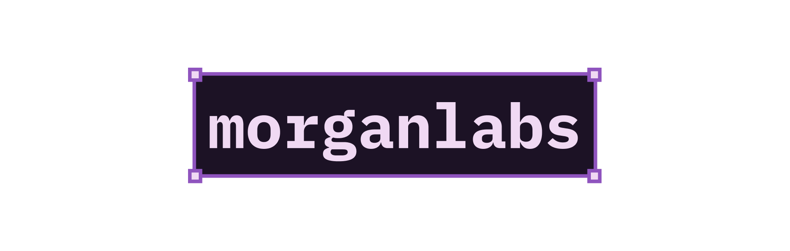

Hey! 👋 I'm Morgan. I am {{ age }} years old and I live in Wales.

I am a full-stack developer with a love for the backend more than anything. I
have used:

* HTML
* (S)CSS
* Java/TypeScript
* Next.JS
* SvelteKit
* Astro
* Python

Currently, I am in the process of learning Go! JavaScript was a nice start for
me, but I find myself wanting better, more performant applications. I tried
Rust for a while, and I would still love to learn it in the future, but Go
seems like a better option for me.

